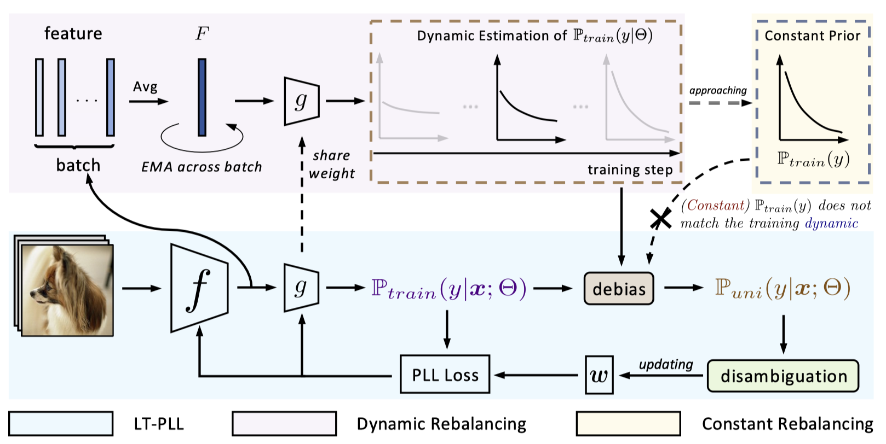

# Long-Tailed Partial Label Learning via Dynamic Rebalancing

by [Feng Hong](https://github.com/Feng-Hong/), [Jiangchao Yao](https://sunarker.github.io), [Zhihan Zhou](https://github.com/Zhihan-Zhou), [Ya Zhang](https://mediabrain.sjtu.edu.cn/yazhang/), and [Yanfeng Wang](https://cmic.sjtu.edu.cn/wangyanfeng/) at SJTU and Shanghai AI Lab.

<em>International Conference on Learning Representations (ICLR), 2023.</em>

[OpenReview](https://openreview.net/forum?id=sXfWoK4KvSW)



This repository is the official Pytorch implementation of RECORDS.

## Citation

If you find our work inspiring or use our codebase in your research, please consider giving a star ⭐ and a citation.
```
@inproceedings{hong2023long,
  title={Long-Tailed Partial Label Learning via Dynamic Rebalancing},
  author={Hong, Feng and Yao, Jiangchao and Zhou, Zhihan and Zhang, Ya and Wang, Yanfeng},
  booktitle={{ICLR}},
  year={2023}
}
```

## Overview

* We delve into a more practical but under-explored LT-PLL scenario, and identify its several challenges in this task that cannot be addressed and even lead to failure by the straightforward combination of the current long-tailed learning and partial label learning.
* We propose a novel RECORDS for LT-PLL that conducts the dynamic adjustment to rebalance the training without requiring any prior about the class distribution. The theoretical and empirical analysis show that the dynamic parametric class distribution is asymmetrically approaching to the oracle class distribution but more friendly to label disambiguation.
* Our method is orthogonal to existing PLL methods and can be easily plugged into the current PLL methods in an end-to-end manner.

## Get Started

### Environment
The project is tested under the following environment settings:
- OS: Ubuntu 18.04.5
- GPU: NVIDIA GeForce RTX 3090
- Python: 3.7.10
- PyTorch: 1.7.1
- Torchvision: 0.8.2
- Cudatoolkit: 11.0.221
- Numpy: 1.21.2

### File Structure

After the preparation work, the whole project should have the following structure:
```
./RECORDS-LTPLL
├── README.md
├── models              # models
│   ├── resnet.py
├── utils               # utils: datasets, losses, etc.
│   ├── cifar10.py
│   ├── cifar100.py
│   ├── imbalance_cifar.py
│   ├── randaugment.py
│   ├── utils_algo.py
│   ├── utils_loss.py
└── train.py            # train
```

### Running

#### Run CORR[[1]](#CORR) on CIFAR-10-LT with $q=0.3$ and Imbalance ratio $\rho = 0.01$
```shell
CUDA_VISIBLE_DEVICES=0 python -u train.py --exp_dir experiment/CORR-CIFAR-10 --dataset cifar10_im --num_class 10 --dist_url 'tcp://localhost:10000' --multiprocessing_distributed --world_size 1 --rank 0 --seed 123 --arch resnet18 --upd_start 1 --lr 0.01 --wd 1e-3 --cosine --epochs 800 --print_freq 100 --partial_rate 0.3 --imb_factor 0.01
```

#### Run CORR + RECORDS on CIFAR-10-LT with $q=0.3$ and Imbalance ratio $\rho = 0.01$
```shell
CUDA_VISIBLE_DEVICES=0 python -u train.py --exp_dir experiment/CORR-CIFAR-10 --dataset cifar10_im --num_class 10 --dist_url 'tcp://localhost:10001' --multiprocessing_distributed --world_size 1 --rank 0 --seed 123 --arch resnet18 --upd_start 1 --lr 0.01 --wd 1e-3 --cosine --epochs 800 --print_freq 100 --partial_rate 0.3 --imb_factor 0.01 --records
```
Note: `--records` means to apply RECORDS on the PLL baseline.

#### Run CORR + RECORDS on CIFAR-100-LT-NU with $q=0.03$ and Imbalance ratio $\rho = 0.01$
```shell
CUDA_VISIBLE_DEVICES=0 python -u train.py --exp_dir experiment/CORR-CIFAR-100 --dataset cifar100_im --num_class 100 --dist_url 'tcp://localhost:10002' --multiprocessing_distributed --world_size 1 --rank 0 --seed 123 --arch resnet18 --upd_start 1 --lr 0.01 --wd 1e-3 --cosine --epochs 800 --print_freq 100 --partial_rate 0.03 --imb_factor 0.01 --records --hierarchical
```
Note: `--hierarchical` means using the non-uniform version of the dataset, i.e., CIFAR-100-LT-NU.

#### Run CORR + RECORDS with Mixup on CIFAR-10-LT with $q=0.3$ and Imbalance ratio $\rho = 0.01$
```shell
CUDA_VISIBLE_DEVICES=0 python -u train.py --exp_dir experiment/CORR-CIFAR-10 --dataset cifar10_im --num_class 10 --dist_url 'tcp://localhost:10003' --multiprocessing_distributed --world_size 1 --rank 0 --seed 123 --arch resnet18 --upd_start 1 --lr 0.01 --wd 1e-3 --cosine --epochs 800 --print_freq 100 --partial_rate 0.3 --imb_factor 0.01 --records --mixup
```
Note: `--mixup` means to use Mixup.


### Results
#### CIFAR-10-LT


| Imbalance ratio $\rho$ |  50   |  50   |  50   |  100  |  100  |  100  |
|:-----:|:-----:|:-----:|:-----:|:-----:|:-----:|:-----:|
| ambiguity $q$          |  0.3  |  0.5  |  0.7  |  0.3  |  0.5  |  0.7  |
| CORR                   | 76.12 | 56.45 | 41.56 | 66.38 | 50.09 | 38.11 |
| CORR + Oracle-LA[[2]](#LA)            | 36.27 | 17.61 | 12.77 | 29.97 | 15.80 | 11.75 |
| CORR + RECORDS              | 82.57 | <i>80.28</i> | <i>67.24</i> | <i>77.66</i> | <i>72.90</i> | <i>57.46</i> |
| SoLar (w/ Mixup)                   | <i>83.88</i>    | 76.55         | 54.61          | 75.38    | 70.63    | 53.15          |
| CORR + RECORDS (w/ Mixup)             |<b>84.25<b> |<b>82.5<b> |<b>71.24<b>|<b>79.79<b>|<b>74.07<b>|<b>62.25<b>|

<!-- <table>
    <tr>
        <td>Imbalance ratio $\rho$</td>
        <td>50</td>
        <td>50</td>
        <td>50</td>
        <td>100</td>
        <td>100</td>
        <td>100</td>
    </tr>
    <tr>
        <td>ambiguity $q$</td>
        <td>0.3</td>
        <td>0.5</td>
        <td>0.7</td>
        <td>0.3</td>
        <td>0.5</td>
        <td>0.7</td>
    </tr>
    <tr>
        <td>CORR</td>
        <td>76.12</td>
        <td>56.45</td>
        <td>41.56</td>
        <td>66.38</td>
        <td>50.09</td>
        <td>38.11</td>
    </tr>
    <tr>
        <td>CORR + Oracle-LA<a href="#LA">[2]</a></td>
        <td>36.27</td>
        <td>17.61</td>
        <td>12.77</td>
        <td>29.97</td>
        <td>15.80</td>
        <td>11.75</td>
    </tr>
    <tr>
        <td>CORR + RECORDS</td>
        <td>82.57</td>
        <td><i>80.28</i></td>
        <td><i>67.24</i></td>
        <td><i>77.66</i></td>
        <td><i>72.90</i></td>
        <td><i>57.46</i></td>
    </tr>
    <tr>
        <td>SoLar (w/ Mixup)</td>
        <td><i>83.88</i></td>
        <td>76.55</td>
        <td>54.61</td>
        <td>75.38</td>
        <td>70.63</td>
        <td>53.15</td>
    </tr>
    <tr>
        <td>CORR + RECORDS (w/ Mixup)</td>
        <td><b>84.25<b></td>
        <td><b>82.5<b></td>
        <td><b>71.24<b></td>
        <td><b>79.79<b></td>
        <td><b>74.07<b></td>
        <td><b>62.25<b></td>
    </tr>
</table> -->

#### CIFAR-100-LT

| Imbalance ratio $\rho$ |     50     |     50     |     50     |     100    |     100    |     100    |
|:-----:|:----------:|:----------:|:----------:|:----------:|:----------:|:----------:|
| ambiguity $q$          | 0.03       | 0.05       | 0.07       | 0.03       | 0.05       | 0.07       |
| CORR                   | 42.29      | 38.03      | 36.59      | 38.39      | 34.09      | 31.05      |
| CORR + Oracle-LA            | 22.56      | 5.59       | 3.12       | 11.37      | 3.32       | 1.98       |
| CORR + RECORDS|<i>48.06</i>|45.56|42.51|42.25|40.59|38.65|
| SoLar (w/ Mixup) |47.93   |<i>46.85</i>    |<i>45.1</i>|<i>42.51</i>       |<i>41.71</i>|<i>39.15</i>      |
| CORR + RECORDS (w/ Mixup)|<b>52.08<b>|<b>50.58<b>|<b>47.91<b>|<b>46.57<b>|<b>45.22<b>|<b>44.73<b>|
<!-- <table>
    <tr>
        <td>Imbalance ratio $\rho$</td>
        <td>50</td>
        <td>50</td>
        <td>50</td>
        <td>100</td>
        <td>100</td>
        <td>100</td>
    </tr>
    <tr>
        <td>ambiguity $q$</td>
        <td>0.03</td>
        <td>0.05</td>
        <td>0.07</td>
        <td>0.03</td>
        <td>0.05</td>
        <td>0.07</td>
    </tr>
    <tr>
        <td>CORR</td>
        <td>42.29</td>
        <td>38.03</td>
        <td>36.59</td>
        <td>38.39</td>
        <td>34.09</td>
        <td>31.05</td>
    </tr>
    <tr>
        <td>CORR + Oracle-LA</td>
        <td>22.56</td>
        <td>5.59</td>
        <td>3.12</td>
        <td>11.37</td>
        <td>3.32</td>
        <td>1.98</td>
    </tr>
    <tr>
        <td>CORR + RECORDS</td>
        <td><i>48.06</i></td>
        <td>45.56</td>
        <td>42.51</td>
        <td>42.25</td>
        <td>40.59</td>
        <td>38.65</td>
    </tr>
    <tr>
        <td>SoLar (w/ Mixup)</td>
        <td>47.93</td>
        <td><i>46.85</i></td>
        <td><i>45.1</i></td>
        <td><i>42.51</i></td>
        <td><i>41.71</i></td>
        <td><i>39.15</i></td>
    </tr>
    <tr>
        <td>CORR + RECORDS (w/ Mixup)</td>
        <td><b>52.08</b></td>
        <td><b>50.58</b></td>
        <td><b>47.91</b></td>
        <td><b>46.57</b></td>
        <td><b>45.22</b></td>
        <td><b>44.73</b></td>
    </tr>
</table> -->

Note: SoLar[[3]](#SoLar) is a concurrent LT-PLL work published in NeuIPS 2022. It improves the label disambiguation process in LT-PLL through the optimal transport technique. Different from SoLar, RECORDS tries to solve the LT-PLL problem from the perspective of rebalancing in a lightweight and effective manner. 

## Acknowledgements

We borrow some codes from [PiCO](https://github.com/hbzju/PiCO), [LDAM-DRW](https://github.com/kaidic/LDAM-DRW), [PRODEN](https://github.com/Lvcrezia77/PRODEN), and [SADE](https://github.com/Vanint/SADE-AgnosticLT).

## References
<span id="CORR">[1]</span> DD Wu, DB Wang, ML Zhang. Revisiting consistency regularization for deep partial label learning. ICML. 2022.

<span id="LA">[2]</span> AK Menon, S Jayasumana, AS Rawat, et al. Long-tail learning via logit adjustment. ICLR. 2021.

<span id="SoLar">[3]</span> H Wang, M Xia, Y Li, et al. SoLar: Sinkhorn Label Refinery for Imbalanced Partial-Label Learning. NeurIPS. 2022.
